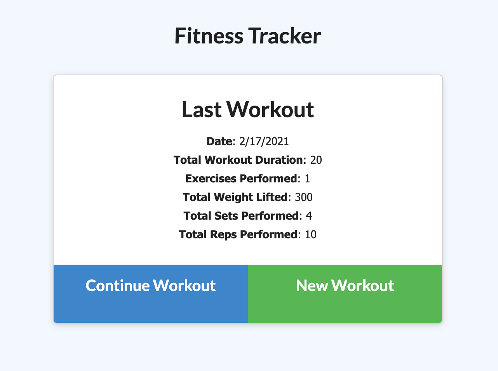
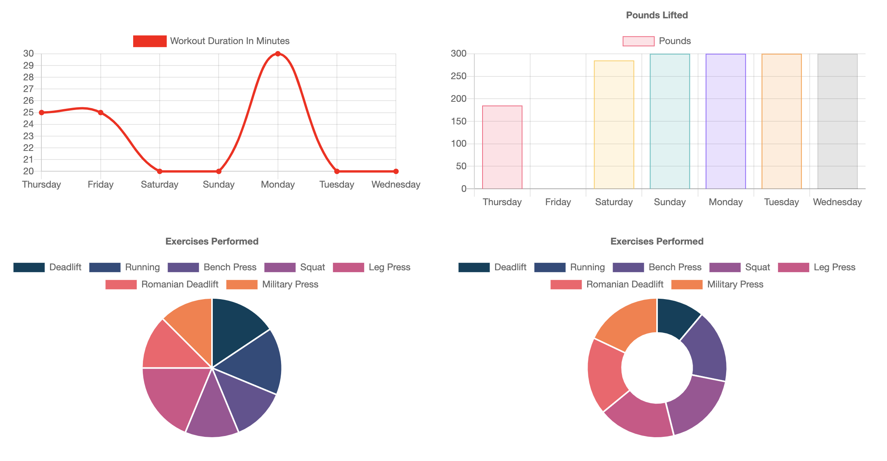
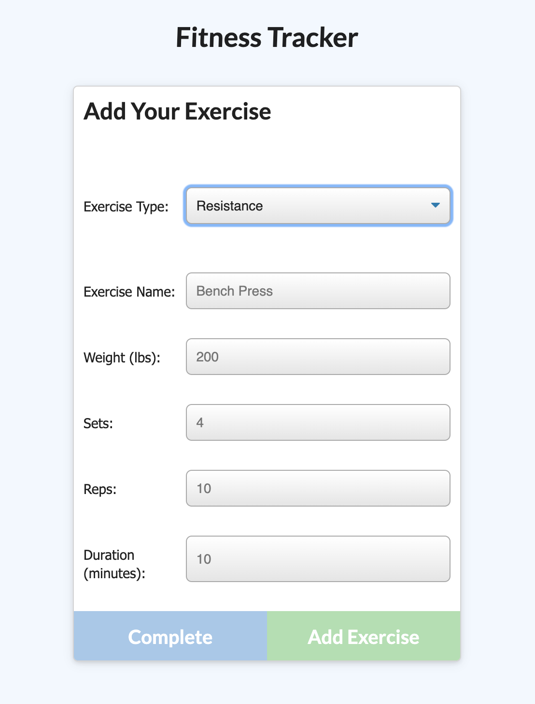
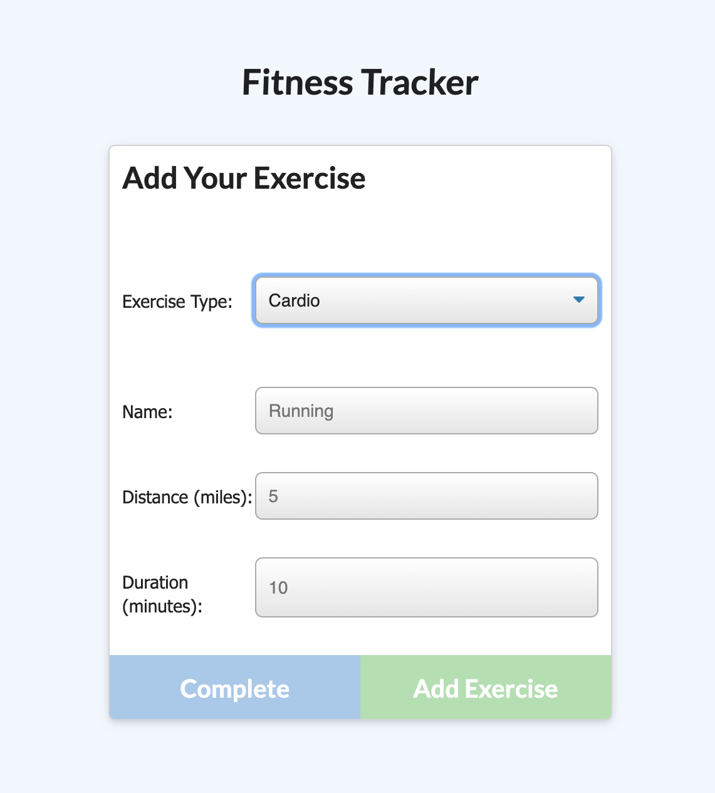

# Exercise Tracker

## Description

Exercise tracker allows users to create and track daily workouts. With this application, one can record multiple exercises whether it be resistance or cardiovascular based. For resistance exercises, the user can log the name, weight, sets, reps, and duration to complete the exercise. If logging a cardiovascular exercise, the user will instead log the name, distance traveled, and duration. Users can visit their dashboard to view statistics related to their seven most recent workouts including the total duration of their workouts, the combined weight lifted, and breakdowns of the duration and weight used for each exercise.

[View deployed project](https://jkg-exercise-tracker.herokuapp.com/)

## Table of Contents

- [Views](#views)
- [Tests](#tests)
- [Questions](#questions)
- [License](#license)

## Views

### Fitness Tracker

### Dashboard

### Resistance Log

### Cardio Log

## Tests

Run `npm run test` to test the API routes with Jest.

## Questions

Please feel free to contact via email if you have any questions pertaining to this project.  
Email: jkole822@gmail.com  
[GitHub Profile](https://github.com/jkole822)

## License

[MIT](https://choosealicense.com/licenses/mit)
